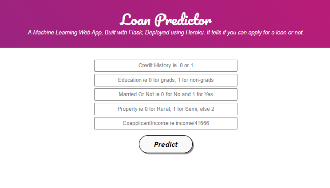

# Loan-Avail-Prediction

This is a web API that predicts if one cas apply for a loan or not based on past records.
The dataset has been obtained from Kaggle.com.
The model accuracy is around 83%, which can be further improved.
Flask has been used for the back-end.

